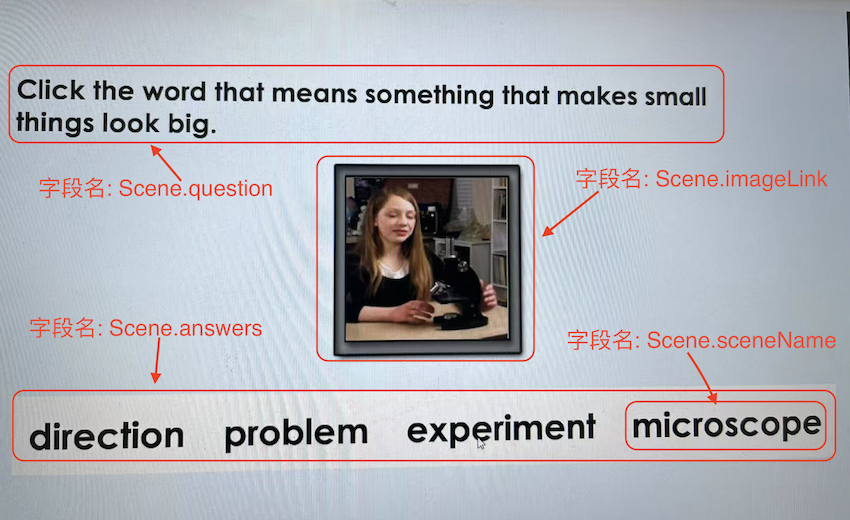
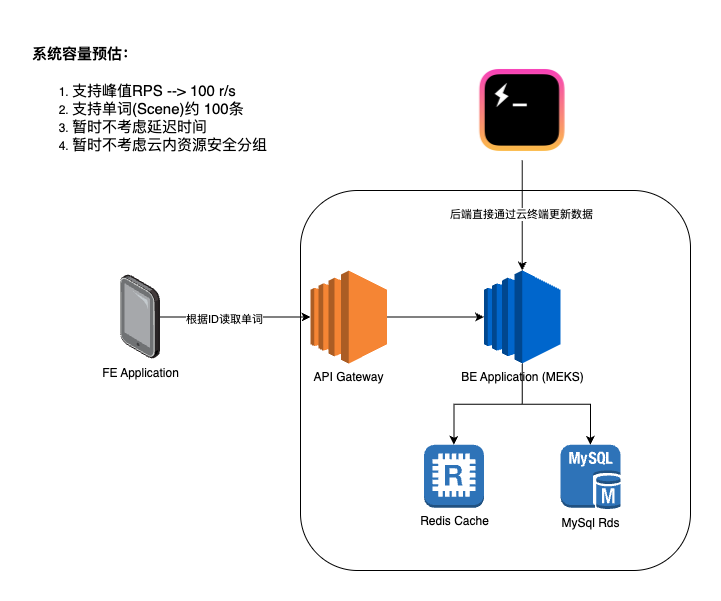
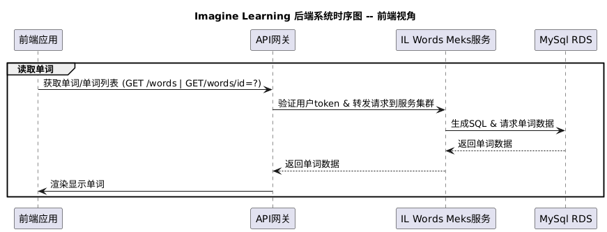

# ImageLearning Backend Engineer Spec
## Context
这个技术文档提供一个针对学单词APP的后端设计。主要包含一个Scene(单词)的表结构设计，为前端提供一个第一步的Https的CRUD APIs。
整体的设计考虑倾向于，简单，可持续开发，快速实现功能；性能以及可维护性等非功能性特性，会在前端和设计切入之后，按照各方需求持续重构。
## Use Case Analysis

1. 我可以跟据ID读取到一个单词，然后通过API获得单词的视频，音频，提示语句，选项;
2. 我可以批量分页地读出一批单词的信息；
3. 我可以创建一个单词，并且上传它相应的资源和资源；
4. 我可以通过单词的ID,更改一个已经存在的单词，包括他相关的资源和属性；
5. 我可以跟据一批输入的单词ID, 删除数据库里对应的单词内容
## Architecture Design

### Tech Stack Selction
这个项目的后端语言建议选择python, 比起使用go语言去追求高并发下的资源优化，预期单词app的并发量并不会达到大型互联app的量级。
Python的简单易用，方便后期更容易找到工程师开发和维护。如果目所能及地发现，并发量开始上来了，对于延迟的需求也提升来了。可以针对新的需求去做后端语言level的重构。
* Programming Language: Python
* BackEnd FrameWork: FastAPI
* ORM: Sqlalchemy

### Cost Estimation
* MEKS: ￥150/月
* RDS for mysql: ￥50/月
* VPC 专有网络(一个子网):
* ELB: ￥30/月
* OSS: 500GB (￥50/月)

## Sequential Flow
### Admin 

### User

## DB Scheme Design
这个把单词抽象为场景Scene, Scene和单词是一一对应的关系，也响应一下IL的听说读写/视频，音频，文字，语意结合的理念。
### 单词(Scene)表格式设计
| 字段名      | 类型              | 描述                  | 约束/索引         |
|-------------|-------------------|-----------------------|-------------------|
| id          | bigint UNSIGNED   | 自增主键              | 主键              |
| sceneID     | varchar(64)       | 场景唯一标识          | 唯一索引          |
| sceneName   | varchar(128)      | 场景名称              | 普通字段          |
| question    | text              | 场景问题              | 普通字段          |
| answers     | json              | 场景答案（JSON格式）  | 普通字段          |
| metaData    | json              | 元数据（JSON格式）    | 普通字段          |
| imageLink   | varchar(255)      | 图片链接              | 普通字段          |
| videoLink   | varchar(255)      | 视频链接              | 普通字段          |
| audioLink   | varchar(255)      | 音频链接              | 普通字段          |
| createdAt   | datetime          | 创建时间              | 默认值、索引      |
| updatedAt   | datetime          | 更新时间              | 默认值、自动更新  |
### Scene Example
```
{
  "sceneID": "SCENE-QUESTION-001",
  "sceneName": "Microscope",
  "question": "what is the things which make small things big?",
  "videoLink": "https://example.com/videos/magnification-explanation.mp4",
  "audioLink": "https://example.com/audios/question-audio.mp3",
  "imageLink": "https://example.com/images/question-image.png",
  "answers": [
    {
      "answerID": "A-001",
      "content": "Magnifying glass (放大镜)",
      "isCorrect": false,
      "explanation": "A magnifying glass uses a convex lens to make small objects appear larger by bending light rays."
    },
    {
      "answerID": "A-002",
      "content": "Microscope (显微镜)",
      "isCorrect": true,
      "explanation": "A microscope is used to view very small objects, but it does not 'make things big' in the same context; it enlarges them for observation."
    }
  ],
  "meta": {
    "category": "science",
    "difficulty": "medium",
    "tags": ["physics", "tools", "magnification"],
    "version": "1.0",
    "createdBy": "Eddard"
  }
}
```
### Answers example
```
[
  {
    "answerID": "A",
    "content": "这是第一个答案",
    "isCorrect": true,
    "score": 10
  },
  {
    "answerID": "B",
    "content": "这是第二个答案",
    "isCorrect": false,
    "score": 0
  }
]
```
### MetaData example
```
{
  "difficulty": "medium",
  "category": "Fruit",
  "tags": ["场景", "问题", "测试"],
  "author": "Ding.Ye",
  "version": "1.0.0"
}
```
## API Contracts
### Contracts Abstract
| **操作** | **HTTP 方法** | **路径** | **请求体** | **响应体** | **状态码** | **说明** |
|----------|---------------|------------------------|----------------------------------------------------------------------------|----------------------------------------------------------------------------|--------------------------|------------------------------------|
| 读取单词 | GET | `/scenes` | 无 | `{"total": 100, "page": 1, "limit": 20, "scenes": [...]}` | 200 OK | 获取单词列表（支持分页） |
| 读取单词 | GET | `/scenes/{id}` | 无 | `{"scenesId": 123, "scenesName": "apple", "resources": [...]}` | 200 OK<br>404 Not Found | 获取单个单词详情 |
| 创建单词 | POST | `/scenes` | `{"word": "apple", "definition": "A fruit...", "resources": [...]}` | `{"scenesId": 123, "created_at": "2023-06-01T12:00:00Z"}` | 201 Created<br>400 Bad Request | 创建新单词 |
| 更新单词 | PUT | `/scenes/{id}` | `{"definition": "A sweet fruit...", "resources": [...]}` | `{"scenesId": 123, "updated_at": "2023-06-03T09:15:00Z"}` | 200 OK<br>404 Not Found | 更新单词信息（全量更新） |
| 删除单词 | DELETE | `/scenes/{id}` | 无 | `{"success": true}` | 200 OK<br>404 Not Found | 删除单词 |
### Header Definition
| **参数名** | **位置** | **类型** | **是否必需** | **说明** |
|------------|----------|----------|--------------|----------|
| `Authorization` | Header | String | 是 | JWT Token（格式：`Bearer {token}`） |
| `page` | Query | Integer | 否 | 页码（默认：1） |
| `limit` | Query | Integer | 否 | 每页数量（默认：20） |
### Error Definition
| **字段** | **类型** | **说明** |
|----------|----------|----------|
| `error.code` | Integer | 错误码（如 400、401） |
| `error.message` | String | 错误消息描述 |
| `error.details` | Object | 错误详情（可选） |
### Status Definition
| **状态码** | **说明** |
|------------|----------|
| 200 OK | 请求成功 |
| 201 Created | 资源创建成功 |
| 400 Bad Request | 参数错误 |
| 401 Unauthorized | 未授权（缺少或无效 Token） |
| 403 Forbidden | 权限不足 |
| 404 Not Found | 资源不存在 |
| 500 Internal Error | 服务器内部错误 |
## Test Plan
### Functional Test
* FrameWork: PostMan 
* Test Report: Doc link
### Stress Test
* 保证文档里所以的API在100 r/s的情况下，latency 低于200ms
* FrameWork: Vegeta 
* Curl Sets: PostMan link

## Deploy GuideLine
为了减少infra上的开销；我们简化部署到云上的策略。直接借用github上的CI/CD build可执行代码，不额外维护ECR服务，最后由系统维护工程师手动配置最新版本的Backend代码。
## MR Split & Timeline estimation
| **任务项**                          | **工期（天）** | **开始时间** | **结束时间** | **状态** | **备注**                          |
|-------------------------------------|----------------|--------------|--------------|----------|-----------------------------------|
| 后端开发文档                | 1              | 2025.6.1          | 2025.6.1          | 已完成   | 开发接受review修改             |
| github repo初始化 & 代码规范指南更新 | 1              | 2025.06.02          | 2025.06.02          | 已完成   | repo链接       |
| CI/CD pipeline 初始化               | 1              | -       | -          | 未开始   | 备注             |
| FastAPI scaffold Init                | 1              | -          | -         | 未开始   | 备注             |
| MySql 初始化 & 配置                | 1              | -          | -          | 未开始   | 备注             |
| API 开发逻辑                | 4              | -          | -          | 未开始   | 备注             |
| 功能性测试                 | 1              | -          | -          | 未开始   | 备注             |
| 云上部署测试                 | 1              | -          | -          | 未开始   | 备注             |


